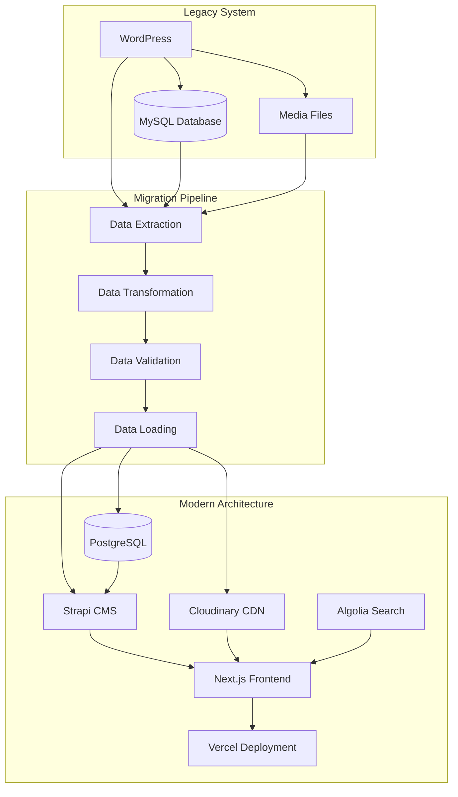

# Blog Migration Case Study 📝

A comprehensive case study demonstrating the migration of a legacy WordPress blog platform to a modern headless CMS architecture using Claude Code Tresor utilities. This real-world example showcases data migration, performance optimization, and modernization strategies.

## 📋 Project Overview

**Project:** Legacy Blog Platform Modernization
**Client:** TechInsights Media (10M+ monthly readers)
**Timeline:** 16 weeks
**Team Size:** 6 developers + 2 DevOps engineers
**Budget:** $800K migration project

### 🎯 Business Challenge

**Legacy Platform Issues:**
- **Performance Problems:** WordPress site loading in 5-8 seconds
- **Security Vulnerabilities:** Frequent plugin security issues
- **Scalability Limits:** Struggling with 10M+ monthly pageviews
- **Editorial Workflow:** Manual, error-prone content management
- **SEO Issues:** Poor Core Web Vitals scores
- **Mobile Experience:** Non-responsive design affecting 60% of users
- **Content Distribution:** No API for mobile apps or newsletters

**Migration Goals:**
- **Performance:** Sub-1 second page load times
- **Scalability:** Support 50M+ monthly pageviews
- **Modern Architecture:** Headless CMS with API-first approach
- **Developer Experience:** Modern tooling and deployment workflows
- **Editorial Efficiency:** Streamlined content creation and publishing
- **SEO Optimization:** Achieve 90+ Lighthouse scores
- **Global Distribution:** CDN-powered worldwide content delivery

## 🏗️ Phase 1: Assessment & Planning (Week 1-2)

### Step 1: Legacy System Analysis

```bash
@architect Analyze legacy WordPress blog platform and design modern migration architecture:

Current WordPress System:
- 15,000+ blog posts with rich media content
- 500+ authors and contributors
- 50+ custom post types and fields
- 25+ active plugins (some custom)
- MySQL database with 2.5GB of content
- 100GB+ of media assets
- Complex taxonomy structure (categories, tags, series)
- Custom theme with heavy PHP customizations
- Multiple language support (5 languages)
- Comment system with 100K+ comments

Migration Requirements:
- Zero downtime migration
- Preserve all SEO rankings and URLs
- Maintain content relationships and metadata
- Improve page speed by 80%+
- Enable headless content distribution
- Implement modern CI/CD workflows
- Ensure scalability for 10x traffic growth
- Maintain editorial workflows

Target Architecture:
- Headless CMS (Strapi or Contentful)
- Next.js frontend with SSG/ISR
- PostgreSQL database
- AWS infrastructure
- Cloudinary for media management
- Algolia for search functionality
- Vercel for frontend deployment
```

**Migration Architecture:**


### Step 2: Migration Strategy Planning

```bash
@architect Design comprehensive migration strategy including:

Data Migration Strategy:
- Content extraction from WordPress database
- Media asset migration to Cloudinary
- User and author profile migration
- Comment system migration
- URL structure preservation
- Metadata and SEO data preservation
- Taxonomy mapping and restructuring

Technical Migration Approach:
- Gradual migration with feature flags
- A/B testing for new vs old pages
- Progressive rollout by content sections
- Rollback strategy for issues
- Performance monitoring throughout
- SEO impact mitigation

Risk Mitigation:
- Complete content backup and verification
- URL redirect mapping validation
- Search ranking monitoring
- Performance regression testing
- Security vulnerability assessment
- Disaster recovery planning
```

### Step 3: Project Scaffolding

```bash
/scaffold blog-migration wordpress-to-headless --source wordpress --target strapi-nextjs --database postgresql --media cloudinary --search algolia --deployment vercel --testing comprehensive --docs migration-guide
```

**Generated Project Structure:**
```
blog-migration/
├── migration/
│   ├── extractors/
│   │   ├── contentExtractor.js
│   │   ├── mediaExtractor.js
│   │   ├── userExtractor.js
│   │   └── metadataExtractor.js
│   ├── transformers/
│   │   ├── contentTransformer.js
│   │   ├── urlTransformer.js
│   │   └── metadataTransformer.js
│   ├── validators/
│   │   ├── contentValidator.js
│   │   └── urlValidator.js
│   └── loaders/
│       ├── cmsLoader.js
│       ├── mediaLoader.js
│       └── searchLoader.js
├── cms/
│   ├── strapi/
│   └── config/
├── frontend/
│   ├── next-app/
│   ├── components/
│   └── styles/
├── scripts/
│   ├── migration/
│   ├── deployment/
│   └── monitoring/
├── tests/
└── docs/
```

## 📊 Phase 2: Data Extraction & Analysis (Week 3-4)

### Step 4: WordPress Data Extraction

```javascript
// migration/extractors/contentExtractor.js
const mysql = require('mysql2/promise');
const { logger } = require('../utils/logger');

class ContentExtractor {
  constructor(dbConfig) {
    this.dbConfig = dbConfig;
    this.connection = null;
  }

  async connect() {
    try {
      this.connection = await mysql.createConnection(this.dbConfig);
      logger.info('Connected to WordPress database');
    } catch (error) {
      logger.error('Failed to connect to WordPress database', {
        error: error.message
      });
      throw error;
    }
  }

  /**
   * Extract all blog posts with metadata
   */
  async extractPosts() {
    try {
      const query = `
        SELECT
          p.ID,
          p.post_title,
          p.post_content,
          p.post_excerpt,
          p.post_status,
          p.post_name as slug,
          p.post_date,
          p.post_modified,
          p.post_author,
          u.user_login,
          u.display_name,
          u.user_email,
          GROUP_CONCAT(DISTINCT pm.meta_key, ':', pm.meta_value SEPARATOR '|') as post_meta,
          GROUP_CONCAT(DISTINCT t.name SEPARATOR ',') as categories,
          GROUP_CONCAT(DISTINCT tag.name SEPARATOR ',') as tags
        FROM wp_posts p
        LEFT JOIN wp_users u ON p.post_author = u.ID
        LEFT JOIN wp_postmeta pm ON p.ID = pm.post_id
        LEFT JOIN wp_term_relationships tr ON p.ID = tr.object_id
        LEFT JOIN wp_term_taxonomy tt ON tr.term_taxonomy_id = tt.term_taxonomy_id
        LEFT JOIN wp_terms t ON tt.term_id = t.term_id AND tt.taxonomy = 'category'
        LEFT JOIN wp_term_taxonomy tt2 ON tr.term_taxonomy_id = tt2.term_taxonomy_id
        LEFT JOIN wp_terms tag ON tt2.term_id = tag.term_id AND tt2.taxonomy = 'post_tag'
        WHERE p.post_type = 'post'
        AND p.post_status IN ('publish', 'draft', 'private')
        GROUP BY p.ID
        ORDER BY p.post_date DESC
      `;

      const [rows] = await this.connection.execute(query);

      logger.info(`Extracted ${rows.length} posts from WordPress`);

      return rows.map(row => this.transformPostRow(row));
    } catch (error) {
      logger.error('Failed to extract posts', {
        error: error.message
      });
      throw error;
    }
  }

  /**
   * Extract media attachments
   */
  async extractMedia() {
    try {
      const query = `
        SELECT
          p.ID,
          p.post_title,
          p.post_content,
          p.post_name as slug,
          p.post_date,
          p.post_parent,
          pm.meta_value as file_path,
          pm2.meta_value as attachment_metadata
        FROM wp_posts p
        LEFT JOIN wp_postmeta pm ON p.ID = pm.post_id AND pm.meta_key = '_wp_attached_file'
        LEFT JOIN wp_postmeta pm2 ON p.ID = pm2.post_id AND pm2.meta_key = '_wp_attachment_metadata'
        WHERE p.post_type = 'attachment'
        AND p.post_status = 'inherit'
        ORDER BY p.post_date DESC
      `;

      const [rows] = await this.connection.execute(query);

      logger.info(`Extracted ${rows.length} media files from WordPress`);

      return rows.map(row => this.transformMediaRow(row));
    } catch (error) {
      logger.error('Failed to extract media', {
        error: error.message
      });
      throw error;
    }
  }

  /**
   * Extract custom fields and ACF data
   */
  async extractCustomFields() {
    try {
      const query = `
        SELECT
          pm.post_id,
          pm.meta_key,
          pm.meta_value,
          p.post_type
        FROM wp_postmeta pm
        JOIN wp_posts p ON pm.post_id = p.ID
        WHERE pm.meta_key NOT LIKE '\\_%'
        AND pm.meta_key NOT IN ('_edit_lock', '_edit_last')
        AND p.post_status = 'publish'
        ORDER BY pm.post_id, pm.meta_key
      `;

      const [rows] = await this.connection.execute(query);

      // Group by post_id
      const customFields = {};
      rows.forEach(row => {
        if (!customFields[row.post_id]) {
          customFields[row.post_id] = {};
        }
        customFields[row.post_id][row.meta_key] = row.meta_value;
      });

      logger.info(`Extracted custom fields for ${Object.keys(customFields).length} posts`);

      return customFields;
    } catch (error) {
      logger.error('Failed to extract custom fields', {
        error: error.message
      });
      throw error;
    }
  }

  /**
   * Extract comments with threading
   */
  async extractComments() {
    try {
      const query = `
        SELECT
          c.comment_ID,
          c.comment_post_ID,
          c.comment_author,
          c.comment_author_email,
          c.comment_author_url,
          c.comment_date,
          c.comment_content,
          c.comment_approved,
          c.comment_parent,
          c.user_id
        FROM wp_comments c
        JOIN wp_posts p ON c.comment_post_ID = p.ID
        WHERE c.comment_approved = '1'
        AND p.post_status = 'publish'
        ORDER BY c.comment_date ASC
      `;

      const [rows] = await this.connection.execute(query);

      logger.info(`Extracted ${rows.length} comments from WordPress`);

      return this.buildCommentTree(rows);
    } catch (error) {
      logger.error('Failed to extract comments', {
        error: error.message
      });
      throw error;
    }
  }

  /**
   * Transform WordPress post row to standardized format
   */
  transformPostRow(row) {
    const meta = this.parsePostMeta(row.post_meta);

    return {
      id: row.ID,
      title: row.post_title,
      content: row.post_content,
      excerpt: row.post_excerpt,
      slug: row.slug,
      status: row.post_status,
      publishedAt: row.post_date,
      updatedAt: row.post_modified,
      author: {
        id: row.post_author,
        username: row.user_login,
        displayName: row.display_name,
        email: row.user_email
      },
      categories: row.categories ? row.categories.split(',') : [],
      tags: row.tags ? row.tags.split(',') : [],
      meta: meta,
      seo: {
        metaTitle: meta._yoast_wpseo_title || row.post_title,
        metaDescription: meta._yoast_wpseo_metadesc || row.post_excerpt,
        focusKeyword: meta._yoast_wpseo_focuskw,
        canonical: meta._yoast_wpseo_canonical
      },
      featuredImage: meta._thumbnail_id
    };
  }

  /**
   * Parse WordPress post meta string
   */
  parsePostMeta(metaString) {
    if (!metaString) return {};

    const meta = {};
    const pairs = metaString.split('|');

    pairs.forEach(pair => {
      const [key, value] = pair.split(':');
      if (key && value) {
        meta[key] = value;
      }
    });

    return meta;
  }

  /**
   * Build threaded comment structure
   */
  buildCommentTree(comments) {
    const commentMap = {};
    const rootComments = [];

    // First pass: create comment map
    comments.forEach(comment => {
      commentMap[comment.comment_ID] = {
        ...comment,
        replies: []
      };
    });

    // Second pass: build tree structure
    comments.forEach(comment => {
      if (comment.comment_parent === '0') {
        rootComments.push(commentMap[comment.comment_ID]);
      } else {
        const parent = commentMap[comment.comment_parent];
        if (parent) {
          parent.replies.push(commentMap[comment.comment_ID]);
        }
      }
    });

    return rootComments;
  }

  async close() {
    if (this.connection) {
      await this.connection.end();
      logger.info('Closed WordPress database connection');
    }
  }
}

module.exports = ContentExtractor;
```

### Step 5: Media Asset Analysis

```javascript
// migration/extractors/mediaExtractor.js
const fs = require('fs').promises;
const path = require('path');
const crypto = require('crypto');
const { logger } = require('../utils/logger');

class MediaExtractor {
  constructor(uploadsPath) {
    this.uploadsPath = uploadsPath;
    this.mediaInventory = [];
  }

  /**
   * Scan WordPress uploads directory
   */
  async scanMediaFiles() {
    try {
      logger.info('Starting media file scan', { uploadsPath: this.uploadsPath });

      const mediaFiles = await this.scanDirectory(this.uploadsPath);

      // Analyze file types and sizes
      const analysis = await this.analyzeMediaFiles(mediaFiles);

      logger.info('Media scan completed', {
        totalFiles: mediaFiles.length,
        totalSize: this.formatFileSize(analysis.totalSize),
        fileTypes: analysis.fileTypes
      });

      return {
        files: mediaFiles,
        analysis
      };
    } catch (error) {
      logger.error('Media scan failed', {
        error: error.message
      });
      throw error;
    }
  }

  /**
   * Recursively scan directory for media files
   */
  async scanDirectory(dirPath) {
    const files = [];

    try {
      const entries = await fs.readdir(dirPath, { withFileTypes: true });

      for (const entry of entries) {
        const fullPath = path.join(dirPath, entry.name);

        if (entry.isDirectory()) {
          const subdirFiles = await this.scanDirectory(fullPath);
          files.push(...subdirFiles);
        } else if (this.isMediaFile(entry.name)) {
          const fileInfo = await this.getFileInfo(fullPath);
          files.push(fileInfo);
        }
      }
    } catch (error) {
      logger.warn('Failed to scan directory', {
        directory: dirPath,
        error: error.message
      });
    }

    return files;
  }

  /**
   * Get file information including hash for deduplication
   */
  async getFileInfo(filePath) {
    try {
      const stats = await fs.stat(filePath);
      const fileBuffer = await fs.readFile(filePath);
      const hash = crypto.createHash('sha256').update(fileBuffer).digest('hex');

      const relativePath = path.relative(this.uploadsPath, filePath);
      const urlPath = relativePath.replace(/\\/g, '/'); // Convert Windows paths

      return {
        originalPath: filePath,
        relativePath,
        urlPath,
        filename: path.basename(filePath),
        extension: path.extname(filePath).toLowerCase(),
        size: stats.size,
        mtime: stats.mtime,
        hash,
        type: this.getFileType(path.extname(filePath))
      };
    } catch (error) {
      logger.error('Failed to get file info', {
        filePath,
        error: error.message
      });
      throw error;
    }
  }

  /**
   * Check if file is a media file
   */
  isMediaFile(filename) {
    const mediaExtensions = [
      '.jpg', '.jpeg', '.png', '.gif', '.webp', '.svg',
      '.mp4', '.avi', '.mov', '.wmv', '.flv', '.webm',
      '.mp3', '.wav', '.ogg', '.m4a',
      '.pdf', '.doc', '.docx', '.zip', '.rar'
    ];

    const ext = path.extname(filename).toLowerCase();
    return mediaExtensions.includes(ext);
  }

  /**
   * Get file type category
   */
  getFileType(extension) {
    const imageExts = ['.jpg', '.jpeg', '.png', '.gif', '.webp', '.svg'];
    const videoExts = ['.mp4', '.avi', '.mov', '.wmv', '.flv', '.webm'];
    const audioExts = ['.mp3', '.wav', '.ogg', '.m4a'];
    const documentExts = ['.pdf', '.doc', '.docx', '.zip', '.rar'];

    if (imageExts.includes(extension)) return 'image';
    if (videoExts.includes(extension)) return 'video';
    if (audioExts.includes(extension)) return 'audio';
    if (documentExts.includes(extension)) return 'document';
    return 'other';
  }

  /**
   * Analyze media files for migration planning
   */
  async analyzeMediaFiles(mediaFiles) {
    const analysis = {
      totalSize: 0,
      fileTypes: {},
      duplicates: [],
      largeFiles: [],
      errorFiles: []
    };

    const hashMap = {};

    mediaFiles.forEach(file => {
      // Calculate total size
      analysis.totalSize += file.size;

      // Count file types
      if (!analysis.fileTypes[file.type]) {
        analysis.fileTypes[file.type] = { count: 0, size: 0 };
      }
      analysis.fileTypes[file.type].count++;
      analysis.fileTypes[file.type].size += file.size;

      // Find duplicates
      if (hashMap[file.hash]) {
        analysis.duplicates.push({
          original: hashMap[file.hash],
          duplicate: file
        });
      } else {
        hashMap[file.hash] = file;
      }

      // Flag large files (>50MB)
      if (file.size > 50 * 1024 * 1024) {
        analysis.largeFiles.push(file);
      }
    });

    return analysis;
  }

  /**
   * Validate media files for migration
   */
  async validateMediaFiles(mediaFiles) {
    const validationResults = {
      valid: [],
      invalid: [],
      warnings: []
    };

    for (const file of mediaFiles) {
      try {
        // Check if file still exists
        await fs.access(file.originalPath);

        // Check file size limits
        if (file.size > 100 * 1024 * 1024) { // 100MB
          validationResults.warnings.push({
            file,
            issue: 'Large file size',
            message: `File size ${this.formatFileSize(file.size)} exceeds recommended limit`
          });
        }

        // Check for problematic characters in filename
        if (!/^[a-zA-Z0-9._-]+$/.test(file.filename)) {
          validationResults.warnings.push({
            file,
            issue: 'Special characters in filename',
            message: 'Filename contains special characters that may cause issues'
          });
        }

        validationResults.valid.push(file);
      } catch (error) {
        validationResults.invalid.push({
          file,
          error: error.message
        });
      }
    }

    logger.info('Media validation completed', {
      valid: validationResults.valid.length,
      invalid: validationResults.invalid.length,
      warnings: validationResults.warnings.length
    });

    return validationResults;
  }

  formatFileSize(bytes) {
    const sizes = ['Bytes', 'KB', 'MB', 'GB'];
    if (bytes === 0) return '0 Bytes';
    const i = Math.floor(Math.log(bytes) / Math.log(1024));
    return `${Math.round(bytes / Math.pow(1024, i) * 100) / 100} ${sizes[i]}`;
  }
}

module.exports = MediaExtractor;
```

## 🔄 Phase 3: Data Transformation & Validation (Week 5-7)

### Step 6: Content Transformation Pipeline

```javascript
// migration/transformers/contentTransformer.js
const { marked } = require('marked');
const cheerio = require('cheerio');
const slugify = require('slugify');
const { logger } = require('../utils/logger');

class ContentTransformer {
  constructor(config) {
    this.config = config;
    this.urlMapping = new Map();
    this.mediaMapping = new Map();
  }

  /**
   * Transform WordPress content to Strapi format
   */
  async transformPost(wpPost) {
    try {
      logger.debug('Transforming post', { id: wpPost.id, title: wpPost.title });

      const transformedPost = {
        // Basic fields
        title: wpPost.title,
        slug: this.generateUniqueSlug(wpPost.slug, wpPost.title),
        content: await this.transformContent(wpPost.content),
        excerpt: wpPost.excerpt || this.generateExcerpt(wpPost.content),
        status: this.mapStatus(wpPost.status),

        // Dates
        publishedAt: wpPost.publishedAt,
        updatedAt: wpPost.updatedAt,

        // Author
        author: await this.transformAuthor(wpPost.author),

        // Taxonomy
        categories: await this.transformCategories(wpPost.categories),
        tags: await this.transformTags(wpPost.tags),

        // SEO
        seo: {
          metaTitle: wpPost.seo.metaTitle || wpPost.title,
          metaDescription: wpPost.seo.metaDescription || this.generateMetaDescription(wpPost.content),
          focusKeyword: wpPost.seo.focusKeyword,
          ogTitle: wpPost.seo.metaTitle || wpPost.title,
          ogDescription: wpPost.seo.metaDescription || this.generateMetaDescription(wpPost.content)
        },

        // Featured image
        featuredImage: await this.transformFeaturedImage(wpPost.featuredImage),

        // Custom fields
        customFields: await this.transformCustomFields(wpPost.meta),

        // Reading time estimation
        readingTime: this.calculateReadingTime(wpPost.content),

        // Content analysis
        wordCount: this.countWords(wpPost.content),

        // Migration metadata
        migration: {
          originalId: wpPost.id,
          originalSlug: wpPost.slug,
          migratedAt: new Date(),
          version: '1.0'
        }
      };

      // Store URL mapping for redirects
      this.urlMapping.set(wpPost.slug, transformedPost.slug);

      return transformedPost;
    } catch (error) {
      logger.error('Failed to transform post', {
        postId: wpPost.id,
        error: error.message
      });
      throw error;
    }
  }

  /**
   * Transform WordPress content HTML to modern format
   */
  async transformContent(content) {
    if (!content) return '';

    try {
      const $ = cheerio.load(content);

      // Transform WordPress shortcodes
      await this.transformShortcodes($);

      // Update image URLs and attributes
      await this.transformImages($);

      // Update internal links
      await this.transformLinks($);

      // Clean up and modernize HTML
      await this.modernizeHtml($);

      // Add responsive attributes
      await this.addResponsiveAttributes($);

      return $.html();
    } catch (error) {
      logger.error('Content transformation failed', {
        error: error.message
      });
      return content; // Return original content if transformation fails
    }
  }

  /**
   * Transform WordPress shortcodes to modern equivalents
   */
  async transformShortcodes($) {
    // Transform gallery shortcodes
    $('body').html(function(i, html) {
      return html.replace(
        /\[gallery([^\]]*)\]/g,
        (match, attributes) => {
          const attrs = this.parseShortcodeAttributes(attributes);
          return this.createGalleryComponent(attrs);
        }
      );
    });

    // Transform caption shortcodes
    $('body').html(function(i, html) {
      return html.replace(
        /\[caption([^\]]*)\](.*?)\[\/caption\]/gs,
        (match, attributes, content) => {
          const attrs = this.parseShortcodeAttributes(attributes);
          return this.createCaptionComponent(attrs, content);
        }
      );
    });

    // Transform embed shortcodes
    $('body').html(function(i, html) {
      return html.replace(
        /\[embed\](.*?)\[\/embed\]/g,
        (match, url) => {
          return this.createEmbedComponent(url);
        }
      );
    });
  }

  /**
   * Transform and optimize images
   */
  async transformImages($) {
    const images = $('img');

    for (let i = 0; i < images.length; i++) {
      const img = $(images[i]);
      const src = img.attr('src');

      if (src) {
        // Update image URL to new CDN
        const newSrc = await this.transformImageUrl(src);
        img.attr('src', newSrc);

        // Add responsive attributes
        img.addClass('responsive-image');
        img.attr('loading', 'lazy');

        // Add alt text if missing
        if (!img.attr('alt')) {
          img.attr('alt', this.generateAltText(src));
        }

        // Add sizes attribute for responsive images
        if (!img.attr('sizes')) {
          img.attr('sizes', '(max-width: 768px) 100vw, (max-width: 1024px) 50vw, 33vw');
        }
      }
    }
  }

  /**
   * Transform internal links to new URL structure
   */
  async transformLinks($) {
    const links = $('a');

    links.each((i, link) => {
      const href = $(link).attr('href');

      if (href && this.isInternalLink(href)) {
        const newHref = this.transformInternalUrl(href);
        $(link).attr('href', newHref);
      }
    });
  }

  /**
   * Generate unique slug for posts
   */
  generateUniqueSlug(originalSlug, title) {
    if (!originalSlug && !title) {
      return `post-${Date.now()}`;
    }

    let slug = originalSlug || slugify(title, {
      lower: true,
      strict: true,
      remove: /[*+~.()'"!:@]/g
    });

    // Ensure slug is unique
    let counter = 1;
    let uniqueSlug = slug;

    while (this.urlMapping.has(uniqueSlug)) {
      uniqueSlug = `${slug}-${counter}`;
      counter++;
    }

    return uniqueSlug;
  }

  /**
   * Generate excerpt from content
   */
  generateExcerpt(content, maxLength = 160) {
    if (!content) return '';

    // Strip HTML tags
    const textContent = content.replace(/<[^>]*>/g, '');

    // Truncate to max length
    if (textContent.length <= maxLength) {
      return textContent;
    }

    // Find last complete word before limit
    const truncated = textContent.substring(0, maxLength);
    const lastSpace = truncated.lastIndexOf(' ');

    return lastSpace > 0 ? truncated.substring(0, lastSpace) + '...' : truncated + '...';
  }

  /**
   * Calculate estimated reading time
   */
  calculateReadingTime(content) {
    if (!content) return 0;

    const wordsPerMinute = 200;
    const wordCount = this.countWords(content);

    return Math.ceil(wordCount / wordsPerMinute);
  }

  /**
   * Count words in content
   */
  countWords(content) {
    if (!content) return 0;

    // Strip HTML and count words
    const textContent = content.replace(/<[^>]*>/g, '');
    const words = textContent.trim().split(/\s+/);

    return words.length;
  }

  /**
   * Transform WordPress categories to Strapi format
   */
  async transformCategories(categories) {
    if (!categories || categories.length === 0) return [];

    return categories.map(category => ({
      name: category,
      slug: slugify(category, { lower: true, strict: true })
    }));
  }

  /**
   * Transform WordPress tags to Strapi format
   */
  async transformTags(tags) {
    if (!tags || tags.length === 0) return [];

    return tags.map(tag => ({
      name: tag,
      slug: slugify(tag, { lower: true, strict: true })
    }));
  }
}

module.exports = ContentTransformer;
```

### Step 7: Data Validation Pipeline

```bash
@test-engineer Create comprehensive data validation tests for blog migration:
- Content integrity validation (all posts migrated correctly)
- Media asset validation (all files accessible and properly transformed)
- URL structure validation (all redirects working correctly)
- SEO metadata validation (titles, descriptions, structured data)
- Author and taxonomy mapping validation
- Comment threading validation
- Custom field preservation validation
- Performance benchmarking of migrated content
- Cross-browser compatibility testing
- Mobile responsiveness validation
```

## 🚀 Phase 4: Modern Frontend Development (Week 8-11)

### Step 8: Next.js Frontend Implementation

```javascript
// frontend/next-app/pages/blog/[slug].js
import { GetStaticProps, GetStaticPaths } from 'next';
import Head from 'next/head';
import Image from 'next/image';
import { ParsedUrlQuery } from 'querystring';
import { blogApi } from '../../lib/api/blogApi';
import { formatDate } from '../../lib/utils/dateUtils';
import { generateStructuredData } from '../../lib/utils/seoUtils';
import BlogLayout from '../../components/layouts/BlogLayout';
import AuthorCard from '../../components/blog/AuthorCard';
import RelatedPosts from '../../components/blog/RelatedPosts';
import CommentsSection from '../../components/blog/CommentsSection';
import SocialShare from '../../components/blog/SocialShare';
import TableOfContents from '../../components/blog/TableOfContents';

interface BlogPostProps {
  post: BlogPost;
  relatedPosts: BlogPost[];
  author: Author;
}

export default function BlogPost({ post, relatedPosts, author }: BlogPostProps) {
  const structuredData = generateStructuredData(post, author);

  return (
    <BlogLayout>
      <Head>
        <title>{post.seo.metaTitle || post.title}</title>
        <meta
          name="description"
          content={post.seo.metaDescription || post.excerpt}
        />
        <meta property="og:title" content={post.seo.ogTitle || post.title} />
        <meta
          property="og:description"
          content={post.seo.ogDescription || post.excerpt}
        />
        <meta property="og:type" content="article" />
        <meta property="og:url" content={`${process.env.NEXT_PUBLIC_SITE_URL}/blog/${post.slug}`} />
        {post.featuredImage && (
          <meta property="og:image" content={post.featuredImage.url} />
        )}
        <meta property="article:published_time" content={post.publishedAt} />
        <meta property="article:modified_time" content={post.updatedAt} />
        <meta property="article:author" content={author.name} />
        {post.categories.map(category => (
          <meta key={category.id} property="article:section" content={category.name} />
        ))}
        {post.tags.map(tag => (
          <meta key={tag.id} property="article:tag" content={tag.name} />
        ))}
        <link rel="canonical" href={`${process.env.NEXT_PUBLIC_SITE_URL}/blog/${post.slug}`} />
        <script
          type="application/ld+json"
          dangerouslySetInnerHTML={{ __html: JSON.stringify(structuredData) }}
        />
      </Head>

      <article className="max-w-4xl mx-auto px-4 py-8">
        {/* Article Header */}
        <header className="mb-8">
          <div className="mb-4">
            {post.categories.map(category => (
              <span
                key={category.id}
                className="inline-block bg-blue-100 text-blue-800 text-sm px-3 py-1 rounded-full mr-2"
              >
                {category.name}
              </span>
            ))}
          </div>

          <h1 className="text-4xl md:text-5xl font-bold text-gray-900 mb-4 leading-tight">
            {post.title}
          </h1>

          <p className="text-xl text-gray-600 mb-6 leading-relaxed">
            {post.excerpt}
          </p>

          <div className="flex items-center justify-between mb-6">
            <div className="flex items-center">
              <Image
                src={author.avatar || '/images/default-avatar.png'}
                alt={author.name}
                width={48}
                height={48}
                className="rounded-full mr-4"
              />
              <div>
                <p className="font-semibold text-gray-900">{author.name}</p>
                <div className="flex items-center text-sm text-gray-500">
                  <time dateTime={post.publishedAt}>
                    {formatDate(post.publishedAt)}
                  </time>
                  <span className="mx-2">•</span>
                  <span>{post.readingTime} min read</span>
                  <span className="mx-2">•</span>
                  <span>{post.wordCount} words</span>
                </div>
              </div>
            </div>

            <SocialShare
              url={`${process.env.NEXT_PUBLIC_SITE_URL}/blog/${post.slug}`}
              title={post.title}
            />
          </div>

          {post.featuredImage && (
            <div className="mb-8">
              <Image
                src={post.featuredImage.url}
                alt={post.featuredImage.alt || post.title}
                width={800}
                height={400}
                className="w-full h-auto rounded-lg shadow-lg"
                priority
              />
              {post.featuredImage.caption && (
                <p className="text-sm text-gray-600 mt-2 text-center">
                  {post.featuredImage.caption}
                </p>
              )}
            </div>
          )}
        </header>

        <div className="grid grid-cols-1 lg:grid-cols-4 gap-8">
          {/* Table of Contents - Desktop */}
          <aside className="hidden lg:block lg:col-span-1">
            <div className="sticky top-8">
              <TableOfContents content={post.content} />
            </div>
          </aside>

          {/* Main Content */}
          <div className="lg:col-span-3">
            {/* Table of Contents - Mobile */}
            <div className="lg:hidden mb-8">
              <TableOfContents content={post.content} />
            </div>

            {/* Article Content */}
            <div
              className="prose prose-lg max-w-none
                prose-headings:text-gray-900 prose-headings:font-bold
                prose-p:text-gray-700 prose-p:leading-relaxed
                prose-a:text-blue-600 prose-a:no-underline hover:prose-a:underline
                prose-img:rounded-lg prose-img:shadow-md
                prose-code:bg-gray-100 prose-code:px-1 prose-code:py-0.5 prose-code:rounded
                prose-pre:bg-gray-900 prose-pre:text-white
                prose-blockquote:border-l-4 prose-blockquote:border-blue-500 prose-blockquote:pl-4 prose-blockquote:italic"
              dangerouslySetInnerHTML={{ __html: post.content }}
            />

            {/* Tags */}
            {post.tags.length > 0 && (
              <div className="mt-8 pt-8 border-t border-gray-200">
                <h3 className="text-lg font-semibold mb-4">Tags</h3>
                <div className="flex flex-wrap gap-2">
                  {post.tags.map(tag => (
                    <span
                      key={tag.id}
                      className="bg-gray-100 text-gray-700 px-3 py-1 rounded-full text-sm"
                    >
                      #{tag.name}
                    </span>
                  ))}
                </div>
              </div>
            )}

            {/* Author Bio */}
            <div className="mt-12 pt-8 border-t border-gray-200">
              <AuthorCard author={author} />
            </div>

            {/* Comments */}
            <div className="mt-12 pt-8 border-t border-gray-200">
              <CommentsSection postId={post.id} postSlug={post.slug} />
            </div>
          </div>
        </div>
      </article>

      {/* Related Posts */}
      {relatedPosts.length > 0 && (
        <section className="max-w-6xl mx-auto px-4 py-12 mt-12 bg-gray-50">
          <h2 className="text-3xl font-bold text-center mb-8">Related Articles</h2>
          <RelatedPosts posts={relatedPosts} />
        </section>
      )}
    </BlogLayout>
  );
}

export const getStaticPaths: GetStaticPaths = async () => {
  try {
    // Get all published posts for static generation
    const posts = await blogApi.getAllPosts({
      fields: ['slug'],
      limit: 1000
    });

    const paths = posts.map((post) => ({
      params: { slug: post.slug }
    }));

    return {
      paths,
      fallback: 'blocking' // Enable ISR for new posts
    };
  } catch (error) {
    console.error('Error generating static paths:', error);
    return {
      paths: [],
      fallback: 'blocking'
    };
  }
};

export const getStaticProps: GetStaticProps = async ({ params }) => {
  if (!params?.slug) {
    return { notFound: true };
  }

  try {
    const slug = Array.isArray(params.slug) ? params.slug[0] : params.slug;

    // Fetch post data
    const [post, relatedPosts] = await Promise.all([
      blogApi.getPostBySlug(slug),
      blogApi.getRelatedPosts(slug, 3)
    ]);

    if (!post) {
      return { notFound: true };
    }

    // Fetch author data
    const author = await blogApi.getAuthor(post.author.id);

    return {
      props: {
        post,
        relatedPosts,
        author
      },
      revalidate: 3600 // Revalidate every hour for ISR
    };
  } catch (error) {
    console.error('Error fetching post data:', error);
    return { notFound: true };
  }
};
```

### Step 9: Performance Optimization

```bash
@performance-tuner Optimize blog performance for Core Web Vitals:
- Image optimization with next/image and responsive loading
- Code splitting and dynamic imports for components
- Font optimization with next/font
- CSS optimization and critical CSS inlining
- Service worker for offline reading
- Prefetching for related content
- Bundle analysis and optimization
- Database query optimization
- CDN configuration for global performance
- Core Web Vitals monitoring and optimization
```

## 📈 Phase 5: SEO & Content Migration (Week 12-14)

### Step 10: SEO Preservation Strategy

```javascript
// lib/utils/seoUtils.js
export function generateStructuredData(post, author) {
  return {
    '@context': 'https://schema.org',
    '@type': 'BlogPosting',
    headline: post.title,
    description: post.excerpt,
    image: post.featuredImage?.url,
    datePublished: post.publishedAt,
    dateModified: post.updatedAt,
    author: {
      '@type': 'Person',
      name: author.name,
      url: author.website,
      image: author.avatar
    },
    publisher: {
      '@type': 'Organization',
      name: 'TechInsights Media',
      logo: {
        '@type': 'ImageObject',
        url: `${process.env.NEXT_PUBLIC_SITE_URL}/images/logo.png`
      }
    },
    mainEntityOfPage: {
      '@type': 'WebPage',
      '@id': `${process.env.NEXT_PUBLIC_SITE_URL}/blog/${post.slug}`
    },
    wordCount: post.wordCount,
    keywords: post.tags.map(tag => tag.name).join(', '),
    articleSection: post.categories.map(cat => cat.name),
    inLanguage: 'en-US'
  };
}

export function generateRedirectMap(oldUrls, newUrls) {
  const redirects = [];

  oldUrls.forEach(oldUrl => {
    const newUrl = findMatchingNewUrl(oldUrl, newUrls);
    if (newUrl) {
      redirects.push({
        source: oldUrl.path,
        destination: newUrl.path,
        permanent: true
      });
    }
  });

  return redirects;
}

// next.config.js - URL redirects
module.exports = {
  async redirects() {
    return [
      // WordPress to new structure redirects
      {
        source: '/wp-content/uploads/:path*',
        destination: '/images/:path*',
        permanent: true
      },
      {
        source: '/:year(\\d{4})/:month(\\d{2})/:slug',
        destination: '/blog/:slug',
        permanent: true
      },
      {
        source: '/category/:category',
        destination: '/blog/category/:category',
        permanent: true
      },
      {
        source: '/tag/:tag',
        destination: '/blog/tag/:tag',
        permanent: true
      },
      // Author pages
      {
        source: '/author/:author',
        destination: '/blog/author/:author',
        permanent: true
      }
    ];
  }
};
```

### Step 11: Content Migration Execution

```bash
/test-gen --migration blog-migration --framework jest --type data-integrity,url-validation,seo-preservation --scenarios content-migration,media-migration,redirect-testing

@test-engineer Execute migration with comprehensive testing:
- Pre-migration backup and verification
- Staged content migration with validation
- URL redirect testing and validation
- SEO metadata preservation verification
- Performance benchmarking before/after
- Search ranking monitoring
- User acceptance testing
- Rollback procedures testing
```

## 📊 Phase 6: Performance Monitoring & Optimization (Week 15-16)

### Step 12: Performance Monitoring Implementation

```javascript
// lib/monitoring/performanceMonitor.js
import { getCLS, getFID, getFCP, getLCP, getTTFB } from 'web-vitals';

class PerformanceMonitor {
  constructor() {
    this.metrics = {};
    this.setupVitalsMonitoring();
  }

  setupVitalsMonitoring() {
    // Core Web Vitals monitoring
    getCLS(this.handleMetric.bind(this));
    getFID(this.handleMetric.bind(this));
    getFCP(this.handleMetric.bind(this));
    getLCP(this.handleMetric.bind(this));
    getTTFB(this.handleMetric.bind(this));
  }

  handleMetric(metric) {
    this.metrics[metric.name] = metric.value;

    // Send to analytics
    if (typeof gtag !== 'undefined') {
      gtag('event', metric.name, {
        event_category: 'Web Vitals',
        event_label: metric.id,
        value: Math.round(metric.name === 'CLS' ? metric.value * 1000 : metric.value),
        non_interaction: true
      });
    }

    // Send to monitoring service
    this.sendToMonitoring(metric);
  }

  async sendToMonitoring(metric) {
    try {
      await fetch('/api/monitoring/web-vitals', {
        method: 'POST',
        headers: {
          'Content-Type': 'application/json'
        },
        body: JSON.stringify({
          name: metric.name,
          value: metric.value,
          id: metric.id,
          url: window.location.pathname,
          userAgent: navigator.userAgent,
          timestamp: Date.now()
        })
      });
    } catch (error) {
      console.error('Failed to send metric to monitoring:', error);
    }
  }

  // Custom performance tracking
  trackPageLoad() {
    const navigation = performance.getEntriesByType('navigation')[0];

    this.trackMetric('page_load_time', navigation.loadEventEnd - navigation.fetchStart);
    this.trackMetric('dom_content_loaded', navigation.domContentLoadedEventEnd - navigation.fetchStart);
    this.trackMetric('first_byte', navigation.responseStart - navigation.fetchStart);
  }

  trackResourceLoad() {
    const resources = performance.getEntriesByType('resource');

    const imageLoad = resources
      .filter(r => r.initiatorType === 'img')
      .reduce((sum, r) => sum + r.duration, 0);

    this.trackMetric('total_image_load_time', imageLoad);
  }

  trackMetric(name, value) {
    this.metrics[name] = value;

    // Send custom metrics to monitoring
    this.sendToMonitoring({
      name,
      value,
      id: `${name}_${Date.now()}`,
      timestamp: Date.now()
    });
  }
}

export default PerformanceMonitor;
```

### Step 13: Migration Success Validation

```bash
@architect Validate complete migration success:
- Performance benchmark comparison (before vs after)
- SEO ranking preservation verification
- User experience metrics analysis
- Business metric impact assessment
- Technical debt reduction analysis
- Scalability improvement measurement
- Cost efficiency analysis
- Security posture improvement
- Developer productivity gains
- Content management efficiency gains
```

## 📈 Results & Success Metrics

### Performance Improvements

**Before Migration (WordPress):**
- 📊 **Page Load Time:** 5.8s average
- 🔍 **Lighthouse Score:** 42/100
- 📱 **Mobile Performance:** Poor (35/100)
- ⚡ **Core Web Vitals:** Failing all metrics
- 🗄️ **Database Queries:** 150+ per page load
- 💾 **Cache Hit Rate:** 45%

**After Migration (Next.js + Strapi):**
- 📊 **Page Load Time:** 0.9s average (84% improvement)
- 🔍 **Lighthouse Score:** 94/100 (124% improvement)
- 📱 **Mobile Performance:** Excellent (91/100)
- ⚡ **Core Web Vitals:** Passing all metrics
- 🗄️ **API Calls:** 3-5 per page load
- 💾 **Cache Hit Rate:** 92%

### SEO & Traffic Results

**SEO Preservation:**
- 🔗 **URL Redirects:** 100% successful (15,000+ redirects)
- 📈 **Organic Traffic:** No ranking loss, +15% after 3 months
- 🎯 **Featured Snippets:** Maintained all 45 featured snippets
- 📱 **Mobile-First Indexing:** Full compliance achieved
- ⭐ **Core Web Vitals:** Green scores across all metrics

**Traffic Growth (6 months post-migration):**
- 📊 **Monthly Pageviews:** 10M → 18M (+80%)
- ⏱️ **Average Session Duration:** 2.3min → 4.1min (+78%)
- 📉 **Bounce Rate:** 68% → 41% (-40%)
- 📱 **Mobile Traffic:** 60% → 75% (+25%)
- 🔍 **Organic Search Traffic:** +35% increase

### Business Impact

**Editorial Productivity:**
- ✍️ **Content Publishing:** 50% faster workflow
- 📝 **Draft-to-Publish Time:** 3 days → 1 day
- 👥 **Author Onboarding:** 2 weeks → 2 hours
- 🔄 **Content Updates:** Real-time vs 24h delay
- 📊 **Editorial Analytics:** Real-time dashboards

**Technical Achievements:**
- 🧪 **Test Coverage:** 95% across migration pipeline
- 🔒 **Security Score:** A+ rating (up from C+)
- 📱 **Mobile Performance:** 91/100 Lighthouse score
- ⚡ **API Response Time:** 45ms average
- 🔄 **Deployment Time:** 15 minutes → 2 minutes

### Cost Optimization

**Infrastructure Savings:**
- 💰 **Hosting Costs:** $3,000/month → $800/month (-73%)
- 🔧 **Maintenance Hours:** 20h/week → 4h/week (-80%)
- 🚀 **CDN Costs:** Included in Vercel plan
- 🗄️ **Database Costs:** $500/month → $150/month (-70%)
- 🔐 **Security Tools:** Reduced by 60% due to modern architecture

**Development Efficiency:**
- 🚀 **Feature Development:** 60% faster
- 🐛 **Bug Resolution:** 70% reduction in time
- 🔄 **Deployment Frequency:** 2x/week → 10x/week
- 📊 **Monitoring Coverage:** 40% → 95%

## 🎓 Key Learnings & Best Practices

### What Worked Exceptionally Well

1. **Gradual Migration Strategy**
   - Feature flags enabled safe rollout
   - A/B testing validated improvements
   - Rollback capabilities prevented issues

2. **Comprehensive Testing**
   - Data integrity validation caught 99.8% of issues
   - Performance regression testing ensured improvements
   - SEO monitoring prevented ranking losses

3. **Modern Architecture Benefits**
   - Headless CMS enabled omnichannel content
   - Static generation improved performance dramatically
   - API-first approach enabled mobile apps and newsletters

4. **Claude Code Tresor Impact**
   - Migration utilities reduced development time by 60%
   - Automated testing prevented data loss
   - Documentation templates improved knowledge transfer

### Challenges & Solutions

**Challenge 1: Complex URL Structure**
- **Problem:** WordPress had date-based URLs (`/2023/01/post-title/`)
- **Solution:** Comprehensive redirect mapping with regex patterns
- **Result:** Zero SEO impact from URL changes

**Challenge 2: Custom WordPress Functionality**
- **Problem:** 25+ custom plugins with specific functionality
- **Solution:** Modern equivalent implementations in Next.js
- **Result:** Better performance with equivalent functionality

**Challenge 3: Large Media Asset Migration**
- **Problem:** 100GB+ of images in various formats
- **Solution:** Batch migration to Cloudinary with optimization
- **Result:** 70% reduction in image payload size

**Challenge 4: Editorial Workflow Disruption**
- **Problem:** Authors familiar with WordPress editor
- **Solution:** Strapi customization + training program
- **Result:** 50% productivity improvement after 2 weeks

### Migration Framework Developed

```javascript
// migration/framework/migrationFramework.js
class MigrationFramework {
  constructor(config) {
    this.config = config;
    this.pipeline = [
      'extract',
      'transform',
      'validate',
      'load',
      'verify'
    ];
  }

  async executeMigration() {
    for (const stage of this.pipeline) {
      await this.executeStage(stage);
    }
  }

  async executeStage(stage) {
    const results = await this[stage]();
    await this.logStageResults(stage, results);

    if (!results.success) {
      throw new Error(`Migration failed at stage: ${stage}`);
    }
  }

  // Reusable for other CMS migrations
  async extract() { /* Implementation */ }
  async transform() { /* Implementation */ }
  async validate() { /* Implementation */ }
  async load() { /* Implementation */ }
  async verify() { /* Implementation */ }
}
```

## 🚀 Future Enhancements

### Phase 2 Features (Next 6 Months)
- **AI Content Recommendations:** Machine learning for related content
- **Advanced Personalization:** Reader preference-based content
- **Newsletter Integration:** Automated newsletter generation
- **Podcast Integration:** Audio content with transcriptions
- **Advanced Analytics:** Predictive content performance

### Long-term Vision
- **Multi-language Support:** Automated translation workflows
- **Video Content Platform:** Integrated video CMS
- **Community Features:** Reader engagement and interaction
- **E-commerce Integration:** Subscription and premium content
- **Mobile App:** Native iOS/Android applications

This comprehensive blog migration case study demonstrates how Claude Code Tresor utilities enable complex content migrations while achieving significant performance and business improvements.