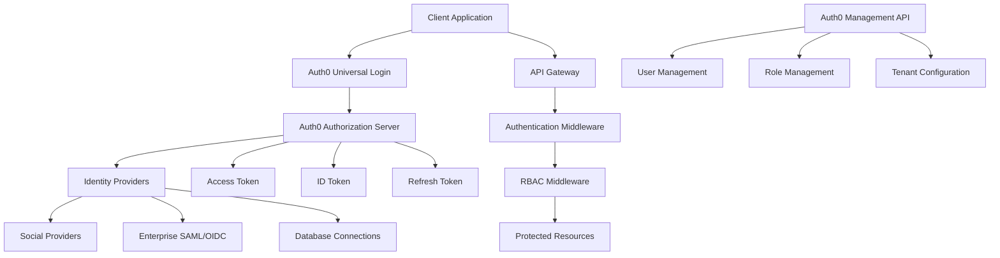

# Auth0 Authentication Integration 🔐

A comprehensive guide for implementing secure authentication and authorization using Auth0 and Claude Code Tresor utilities. This integration demonstrates enterprise-grade authentication patterns, role-based access control, and security best practices.

## 📋 Overview

This integration covers complete Auth0 authentication implementation from setup to production deployment, utilizing Claude Code Tresor's specialized utilities for security, testing, and maintainability.

### 🎯 Integration Goals

- **Enterprise Security**: Industry-standard authentication and authorization
- **Role-Based Access Control**: Granular permission management
- **Single Sign-On**: Seamless SSO across applications
- **Multi-Factor Authentication**: Enhanced security with MFA
- **Social Login**: Easy social provider integration
- **Scalable Architecture**: Support for millions of users

### 🔧 Utilities Used

- **Commands**: `/scaffold`, `/review`, `/test-gen`, `/docs-gen`
- **Agents**: `@security-auditor`, `@code-reviewer`, `@test-engineer`, `@architect`

## 🏗️ Phase 1: Project Setup & Architecture

### Step 1: Initial Project Scaffolding

```bash
/scaffold auth-integration auth0-authentication --features rbac,sso,mfa,social-login --security enterprise --testing comprehensive --docs api-reference
```

**Generated Structure:**
```
auth0-authentication/
├── src/
│   ├── controllers/
│   │   ├── authController.js
│   │   ├── userController.js
│   │   └── adminController.js
│   ├── middleware/
│   │   ├── auth.js
│   │   ├── rbac.js
│   │   └── rateLimiting.js
│   ├── services/
│   │   ├── auth0Service.js
│   │   ├── userService.js
│   │   └── roleService.js
│   ├── models/
│   │   ├── user.js
│   │   ├── role.js
│   │   └── permission.js
│   └── utils/
│       ├── jwt.js
│       └── logger.js
├── frontend/
│   ├── components/
│   │   ├── Login.jsx
│   │   ├── Register.jsx
│   │   └── Profile.jsx
│   └── services/
│       └── authService.js
├── tests/
└── docs/
```

### Step 2: Auth0 Configuration & Architecture Review

```bash
@architect Design authentication architecture for Auth0 integration focusing on:
- Multi-tenant application structure
- Role-based access control (RBAC) patterns
- Token management and refresh strategies
- Social login provider integration
- Multi-factor authentication flows
- Single sign-on (SSO) implementation
- User profile management
- Audit logging and compliance
- Scalability considerations for enterprise use
```

**Architecture Response:**


## 🔐 Phase 2: Core Authentication Implementation

### Step 3: Auth0 Service Implementation

```javascript
// src/services/auth0Service.js
const { ManagementClient, AuthenticationClient } = require('auth0');
const jwt = require('jsonwebtoken');
const { logger } = require('../utils/logger');

class Auth0Service {
  constructor() {
    this.managementClient = new ManagementClient({
      domain: process.env.AUTH0_DOMAIN,
      clientId: process.env.AUTH0_M2M_CLIENT_ID,
      clientSecret: process.env.AUTH0_M2M_CLIENT_SECRET,
      scope: 'read:users update:users delete:users create:users read:roles update:roles delete:roles create:roles'
    });

    this.authenticationClient = new AuthenticationClient({
      domain: process.env.AUTH0_DOMAIN,
      clientId: process.env.AUTH0_CLIENT_ID,
      clientSecret: process.env.AUTH0_CLIENT_SECRET
    });
  }

  /**
   * Verify and decode JWT token
   * @param {string} token - JWT token
   * @returns {Promise<Object>} Decoded token payload
   */
  async verifyToken(token) {
    try {
      const decoded = jwt.verify(token, process.env.AUTH0_JWT_SECRET, {
        audience: process.env.AUTH0_AUDIENCE,
        issuer: `https://${process.env.AUTH0_DOMAIN}/`,
        algorithms: ['RS256']
      });

      logger.info('Token verified successfully', {
        userId: decoded.sub,
        scope: decoded.scope
      });

      return decoded;
    } catch (error) {
      logger.error('Token verification failed', {
        error: error.message,
        token: token.substring(0, 20) + '...'
      });
      throw new Error('Invalid token');
    }
  }

  /**
   * Get user profile from Auth0
   * @param {string} userId - Auth0 user ID
   * @returns {Promise<Object>} User profile
   */
  async getUserProfile(userId) {
    try {
      const user = await this.managementClient.getUser({ id: userId });

      logger.info('User profile retrieved', {
        userId,
        email: user.email
      });

      return {
        id: user.user_id,
        email: user.email,
        name: user.name,
        picture: user.picture,
        emailVerified: user.email_verified,
        lastLogin: user.last_login,
        createdAt: user.created_at,
        metadata: user.user_metadata,
        appMetadata: user.app_metadata
      };
    } catch (error) {
      logger.error('Failed to get user profile', {
        error: error.message,
        userId
      });
      throw new Error('Failed to retrieve user profile');
    }
  }

  /**
   * Update user profile
   * @param {string} userId - Auth0 user ID
   * @param {Object} userData - User data to update
   * @returns {Promise<Object>} Updated user profile
   */
  async updateUserProfile(userId, userData) {
    try {
      const allowedFields = ['name', 'nickname', 'picture', 'user_metadata'];
      const updateData = {};

      // Filter allowed fields
      Object.keys(userData).forEach(key => {
        if (allowedFields.includes(key)) {
          updateData[key] = userData[key];
        }
      });

      const updatedUser = await this.managementClient.updateUser(
        { id: userId },
        updateData
      );

      logger.info('User profile updated', {
        userId,
        updatedFields: Object.keys(updateData)
      });

      return updatedUser;
    } catch (error) {
      logger.error('Failed to update user profile', {
        error: error.message,
        userId
      });
      throw new Error('Failed to update user profile');
    }
  }

  /**
   * Assign roles to user
   * @param {string} userId - Auth0 user ID
   * @param {Array} roleIds - Array of role IDs
   * @returns {Promise<void>}
   */
  async assignRoles(userId, roleIds) {
    try {
      await this.managementClient.assignRolestoUser(
        { id: userId },
        { roles: roleIds }
      );

      logger.info('Roles assigned to user', {
        userId,
        roleIds
      });
    } catch (error) {
      logger.error('Failed to assign roles', {
        error: error.message,
        userId,
        roleIds
      });
      throw new Error('Failed to assign roles');
    }
  }

  /**
   * Get user roles
   * @param {string} userId - Auth0 user ID
   * @returns {Promise<Array>} User roles
   */
  async getUserRoles(userId) {
    try {
      const roles = await this.managementClient.getUserRoles({ id: userId });

      logger.info('User roles retrieved', {
        userId,
        roleCount: roles.length
      });

      return roles.map(role => ({
        id: role.id,
        name: role.name,
        description: role.description
      }));
    } catch (error) {
      logger.error('Failed to get user roles', {
        error: error.message,
        userId
      });
      throw new Error('Failed to retrieve user roles');
    }
  }

  /**
   * Create user in Auth0
   * @param {Object} userData - User data
   * @returns {Promise<Object>} Created user
   */
  async createUser(userData) {
    try {
      const user = await this.managementClient.createUser({
        connection: 'Username-Password-Authentication',
        email: userData.email,
        password: userData.password,
        name: userData.name,
        user_metadata: userData.metadata || {},
        email_verified: false
      });

      logger.info('User created in Auth0', {
        userId: user.user_id,
        email: user.email
      });

      return user;
    } catch (error) {
      logger.error('Failed to create user', {
        error: error.message,
        email: userData.email
      });
      throw new Error('Failed to create user');
    }
  }

  /**
   * Delete user from Auth0
   * @param {string} userId - Auth0 user ID
   * @returns {Promise<void>}
   */
  async deleteUser(userId) {
    try {
      await this.managementClient.deleteUser({ id: userId });

      logger.info('User deleted from Auth0', { userId });
    } catch (error) {
      logger.error('Failed to delete user', {
        error: error.message,
        userId
      });
      throw new Error('Failed to delete user');
    }
  }

  /**
   * Exchange authorization code for tokens
   * @param {string} code - Authorization code
   * @param {string} redirectUri - Redirect URI
   * @returns {Promise<Object>} Token response
   */
  async exchangeCodeForTokens(code, redirectUri) {
    try {
      const tokenResponse = await this.authenticationClient.oauth.authorizationCodeGrant({
        code,
        redirect_uri: redirectUri
      });

      logger.info('Tokens exchanged successfully', {
        hasAccessToken: !!tokenResponse.access_token,
        hasIdToken: !!tokenResponse.id_token,
        hasRefreshToken: !!tokenResponse.refresh_token
      });

      return tokenResponse;
    } catch (error) {
      logger.error('Failed to exchange code for tokens', {
        error: error.message
      });
      throw new Error('Failed to exchange authorization code');
    }
  }

  /**
   * Refresh access token
   * @param {string} refreshToken - Refresh token
   * @returns {Promise<Object>} New tokens
   */
  async refreshAccessToken(refreshToken) {
    try {
      const tokenResponse = await this.authenticationClient.oauth.refreshToken({
        refresh_token: refreshToken
      });

      logger.info('Access token refreshed successfully');

      return tokenResponse;
    } catch (error) {
      logger.error('Failed to refresh access token', {
        error: error.message
      });
      throw new Error('Failed to refresh access token');
    }
  }
}

module.exports = Auth0Service;
```

### Step 4: Authentication Middleware

```javascript
// src/middleware/auth.js
const Auth0Service = require('../services/auth0Service');
const { logger } = require('../utils/logger');

class AuthMiddleware {
  constructor() {
    this.auth0Service = new Auth0Service();
  }

  /**
   * Verify JWT token middleware
   */
  verifyToken() {
    return async (req, res, next) => {
      try {
        const authHeader = req.headers.authorization;

        if (!authHeader || !authHeader.startsWith('Bearer ')) {
          return res.status(401).json({
            error: 'Authorization header missing or invalid'
          });
        }

        const token = authHeader.split(' ')[1];
        const decoded = await this.auth0Service.verifyToken(token);

        // Attach user info to request
        req.user = {
          id: decoded.sub,
          email: decoded.email,
          scope: decoded.scope,
          permissions: decoded.permissions || []
        };

        next();
      } catch (error) {
        logger.error('Authentication failed', {
          error: error.message,
          ip: req.ip,
          userAgent: req.get('User-Agent')
        });

        res.status(401).json({
          error: 'Invalid or expired token'
        });
      }
    };
  }

  /**
   * Optional authentication (allows unauthenticated requests)
   */
  optionalAuth() {
    return async (req, res, next) => {
      try {
        const authHeader = req.headers.authorization;

        if (authHeader && authHeader.startsWith('Bearer ')) {
          const token = authHeader.split(' ')[1];
          const decoded = await this.auth0Service.verifyToken(token);

          req.user = {
            id: decoded.sub,
            email: decoded.email,
            scope: decoded.scope,
            permissions: decoded.permissions || []
          };
        }

        next();
      } catch (error) {
        // Continue without authentication for optional auth
        next();
      }
    };
  }

  /**
   * Require specific scope
   * @param {string} requiredScope - Required scope
   */
  requireScope(requiredScope) {
    return (req, res, next) => {
      if (!req.user) {
        return res.status(401).json({
          error: 'Authentication required'
        });
      }

      const userScopes = req.user.scope ? req.user.scope.split(' ') : [];

      if (!userScopes.includes(requiredScope)) {
        logger.warn('Insufficient scope', {
          userId: req.user.id,
          requiredScope,
          userScopes
        });

        return res.status(403).json({
          error: 'Insufficient scope',
          required: requiredScope
        });
      }

      next();
    };
  }

  /**
   * Require specific permission
   * @param {string} permission - Required permission
   */
  requirePermission(permission) {
    return (req, res, next) => {
      if (!req.user) {
        return res.status(401).json({
          error: 'Authentication required'
        });
      }

      if (!req.user.permissions.includes(permission)) {
        logger.warn('Insufficient permissions', {
          userId: req.user.id,
          requiredPermission: permission,
          userPermissions: req.user.permissions
        });

        return res.status(403).json({
          error: 'Insufficient permissions',
          required: permission
        });
      }

      next();
    };
  }
}

module.exports = AuthMiddleware;
```

### Step 5: Role-Based Access Control (RBAC)

```javascript
// src/middleware/rbac.js
const Auth0Service = require('../services/auth0Service');
const { logger } = require('../utils/logger');

class RBACMiddleware {
  constructor() {
    this.auth0Service = new Auth0Service();
    this.roleCache = new Map();
    this.cacheTimeout = 5 * 60 * 1000; // 5 minutes
  }

  /**
   * Require specific role
   * @param {string|Array} roles - Required role(s)
   */
  requireRole(roles) {
    const requiredRoles = Array.isArray(roles) ? roles : [roles];

    return async (req, res, next) => {
      try {
        if (!req.user) {
          return res.status(401).json({
            error: 'Authentication required'
          });
        }

        const userRoles = await this.getUserRoles(req.user.id);
        const userRoleNames = userRoles.map(role => role.name);

        const hasRequiredRole = requiredRoles.some(role =>
          userRoleNames.includes(role)
        );

        if (!hasRequiredRole) {
          logger.warn('Insufficient role', {
            userId: req.user.id,
            requiredRoles,
            userRoles: userRoleNames
          });

          return res.status(403).json({
            error: 'Insufficient role',
            required: requiredRoles,
            current: userRoleNames
          });
        }

        // Attach roles to request for further use
        req.user.roles = userRoleNames;

        next();
      } catch (error) {
        logger.error('RBAC check failed', {
          error: error.message,
          userId: req.user?.id
        });

        res.status(500).json({
          error: 'Failed to verify role'
        });
      }
    };
  }

  /**
   * Check if user is admin
   */
  requireAdmin() {
    return this.requireRole(['admin', 'super_admin']);
  }

  /**
   * Check if user is moderator or admin
   */
  requireModerator() {
    return this.requireRole(['moderator', 'admin', 'super_admin']);
  }

  /**
   * Resource ownership check
   * @param {Function} getResourceOwner - Function to get resource owner ID
   */
  requireOwnership(getResourceOwner) {
    return async (req, res, next) => {
      try {
        if (!req.user) {
          return res.status(401).json({
            error: 'Authentication required'
          });
        }

        const ownerId = await getResourceOwner(req);

        if (req.user.id !== ownerId) {
          // Check if user has admin role
          const userRoles = await this.getUserRoles(req.user.id);
          const isAdmin = userRoles.some(role =>
            ['admin', 'super_admin'].includes(role.name)
          );

          if (!isAdmin) {
            logger.warn('Access denied - not resource owner', {
              userId: req.user.id,
              resourceOwnerId: ownerId
            });

            return res.status(403).json({
              error: 'Access denied - insufficient permissions'
            });
          }
        }

        next();
      } catch (error) {
        logger.error('Ownership check failed', {
          error: error.message,
          userId: req.user?.id
        });

        res.status(500).json({
          error: 'Failed to verify ownership'
        });
      }
    };
  }

  /**
   * Get user roles with caching
   * @param {string} userId - User ID
   * @returns {Promise<Array>} User roles
   */
  async getUserRoles(userId) {
    const cacheKey = `roles:${userId}`;
    const cached = this.roleCache.get(cacheKey);

    if (cached && Date.now() - cached.timestamp < this.cacheTimeout) {
      return cached.roles;
    }

    try {
      const roles = await this.auth0Service.getUserRoles(userId);

      this.roleCache.set(cacheKey, {
        roles,
        timestamp: Date.now()
      });

      return roles;
    } catch (error) {
      logger.error('Failed to get user roles', {
        error: error.message,
        userId
      });
      throw error;
    }
  }

  /**
   * Clear role cache for user
   * @param {string} userId - User ID
   */
  clearRoleCache(userId) {
    const cacheKey = `roles:${userId}`;
    this.roleCache.delete(cacheKey);
  }
}

module.exports = RBACMiddleware;
```

### Step 6: Security Review

```bash
@security-auditor Review the Auth0 authentication implementation for security vulnerabilities:
- JWT token validation and signature verification
- Scope and permission enforcement
- Role-based access control implementation
- Token storage and transmission security
- Session management and timeout
- Multi-factor authentication integration
- Social login security considerations
- API key and secret management
- Rate limiting on authentication endpoints
- Audit logging for authentication events
```

## 🎭 Phase 3: Frontend Integration

### Step 7: React Authentication Components

```jsx
// frontend/components/Login.jsx
import React, { useState, useEffect } from 'react';
import { useAuth0 } from '@auth0/auth0-react';
import { Button, Alert, Spinner } from 'react-bootstrap';

const Login = () => {
  const {
    loginWithRedirect,
    loginWithPopup,
    isAuthenticated,
    isLoading,
    error,
    user
  } = useAuth0();

  const [loginMethod, setLoginMethod] = useState('redirect');

  const handleLogin = () => {
    if (loginMethod === 'popup') {
      loginWithPopup();
    } else {
      loginWithRedirect();
    }
  };

  const handleSocialLogin = (connection) => {
    loginWithRedirect({
      connection
    });
  };

  if (isLoading) {
    return (
      <div className="d-flex justify-content-center">
        <Spinner animation="border" role="status">
          <span className="sr-only">Loading...</span>
        </Spinner>
      </div>
    );
  }

  if (isAuthenticated) {
    return (
      <div className="text-center">
        <Alert variant="success">
          Welcome, {user.name}! You are successfully logged in.
        </Alert>
      </div>
    );
  }

  return (
    <div className="login-container">
      <div className="card mx-auto" style={{ maxWidth: '400px' }}>
        <div className="card-body">
          <h2 className="card-title text-center mb-4">Login</h2>

          {error && (
            <Alert variant="danger">
              {error.message}
            </Alert>
          )}

          <div className="mb-3">
            <div className="form-check">
              <input
                className="form-check-input"
                type="radio"
                name="loginMethod"
                id="redirect"
                value="redirect"
                checked={loginMethod === 'redirect'}
                onChange={(e) => setLoginMethod(e.target.value)}
              />
              <label className="form-check-label" htmlFor="redirect">
                Redirect to Auth0 (Recommended)
              </label>
            </div>
            <div className="form-check">
              <input
                className="form-check-input"
                type="radio"
                name="loginMethod"
                id="popup"
                value="popup"
                checked={loginMethod === 'popup'}
                onChange={(e) => setLoginMethod(e.target.value)}
              />
              <label className="form-check-label" htmlFor="popup">
                Popup Login
              </label>
            </div>
          </div>

          <Button
            variant="primary"
            size="lg"
            className="w-100 mb-3"
            onClick={handleLogin}
          >
            Login
          </Button>

          <hr />

          <div className="social-login">
            <h6 className="text-center mb-3">Or login with:</h6>

            <div className="d-grid gap-2">
              <Button
                variant="outline-primary"
                onClick={() => handleSocialLogin('google-oauth2')}
              >
                <i className="fab fa-google me-2"></i>
                Continue with Google
              </Button>

              <Button
                variant="outline-dark"
                onClick={() => handleSocialLogin('github')}
              >
                <i className="fab fa-github me-2"></i>
                Continue with GitHub
              </Button>

              <Button
                variant="outline-info"
                onClick={() => handleSocialLogin('linkedin')}
              >
                <i className="fab fa-linkedin me-2"></i>
                Continue with LinkedIn
              </Button>
            </div>
          </div>
        </div>
      </div>
    </div>
  );
};

export default Login;
```

### Step 8: Protected Route Component

```jsx
// frontend/components/ProtectedRoute.jsx
import React from 'react';
import { useAuth0 } from '@auth0/auth0-react';
import { Navigate, useLocation } from 'react-router-dom';
import { Spinner, Alert } from 'react-bootstrap';

const ProtectedRoute = ({
  children,
  requiredRole = null,
  requiredPermission = null
}) => {
  const { isAuthenticated, isLoading, user, error } = useAuth0();
  const location = useLocation();

  if (isLoading) {
    return (
      <div className="d-flex justify-content-center mt-5">
        <Spinner animation="border" role="status">
          <span className="sr-only">Loading...</span>
        </Spinner>
      </div>
    );
  }

  if (error) {
    return (
      <Alert variant="danger">
        Authentication error: {error.message}
      </Alert>
    );
  }

  if (!isAuthenticated) {
    return <Navigate to="/login" state={{ from: location }} replace />;
  }

  // Check role requirements
  if (requiredRole) {
    const userRoles = user['https://myapp.com/roles'] || [];
    if (!userRoles.includes(requiredRole)) {
      return (
        <Alert variant="warning">
          Access denied. Required role: {requiredRole}
        </Alert>
      );
    }
  }

  // Check permission requirements
  if (requiredPermission) {
    const userPermissions = user['https://myapp.com/permissions'] || [];
    if (!userPermissions.includes(requiredPermission)) {
      return (
        <Alert variant="warning">
          Access denied. Required permission: {requiredPermission}
        </Alert>
      );
    }
  }

  return children;
};

export default ProtectedRoute;
```

### Step 9: User Profile Management

```jsx
// frontend/components/Profile.jsx
import React, { useState, useEffect } from 'react';
import { useAuth0 } from '@auth0/auth0-react';
import {
  Card,
  Form,
  Button,
  Alert,
  Badge,
  ListGroup,
  Modal
} from 'react-bootstrap';
import { authService } from '../services/authService';

const Profile = () => {
  const { user, getAccessTokenSilently, logout } = useAuth0();
  const [profile, setProfile] = useState(null);
  const [editing, setEditing] = useState(false);
  const [formData, setFormData] = useState({});
  const [loading, setLoading] = useState(false);
  const [message, setMessage] = useState(null);
  const [showMFAModal, setShowMFAModal] = useState(false);

  useEffect(() => {
    loadProfile();
  }, []);

  const loadProfile = async () => {
    try {
      setLoading(true);
      const token = await getAccessTokenSilently();
      const profileData = await authService.getProfile(token);
      setProfile(profileData);
      setFormData({
        name: profileData.name || '',
        nickname: profileData.nickname || '',
        bio: profileData.user_metadata?.bio || ''
      });
    } catch (error) {
      setMessage({
        type: 'error',
        text: 'Failed to load profile: ' + error.message
      });
    } finally {
      setLoading(false);
    }
  };

  const handleSave = async () => {
    try {
      setLoading(true);
      const token = await getAccessTokenSilently();

      const updateData = {
        name: formData.name,
        nickname: formData.nickname,
        user_metadata: {
          bio: formData.bio
        }
      };

      await authService.updateProfile(token, updateData);
      await loadProfile();
      setEditing(false);
      setMessage({
        type: 'success',
        text: 'Profile updated successfully!'
      });
    } catch (error) {
      setMessage({
        type: 'error',
        text: 'Failed to update profile: ' + error.message
      });
    } finally {
      setLoading(false);
    }
  };

  const enableMFA = async () => {
    try {
      const token = await getAccessTokenSilently();
      await authService.enableMFA(token);
      setShowMFAModal(false);
      setMessage({
        type: 'success',
        text: 'MFA enabled successfully!'
      });
      await loadProfile();
    } catch (error) {
      setMessage({
        type: 'error',
        text: 'Failed to enable MFA: ' + error.message
      });
    }
  };

  if (loading && !profile) {
    return <div>Loading profile...</div>;
  }

  return (
    <div className="container mt-4">
      <div className="row">
        <div className="col-md-8 mx-auto">
          {message && (
            <Alert
              variant={message.type === 'error' ? 'danger' : 'success'}
              onClose={() => setMessage(null)}
              dismissible
            >
              {message.text}
            </Alert>
          )}

          <Card>
            <Card.Header className="d-flex justify-content-between align-items-center">
              <h4>User Profile</h4>
              <div>
                {!editing ? (
                  <Button
                    variant="outline-primary"
                    size="sm"
                    onClick={() => setEditing(true)}
                  >
                    Edit Profile
                  </Button>
                ) : (
                  <div>
                    <Button
                      variant="success"
                      size="sm"
                      onClick={handleSave}
                      disabled={loading}
                      className="me-2"
                    >
                      Save
                    </Button>
                    <Button
                      variant="secondary"
                      size="sm"
                      onClick={() => {
                        setEditing(false);
                        setFormData({
                          name: profile.name || '',
                          nickname: profile.nickname || '',
                          bio: profile.user_metadata?.bio || ''
                        });
                      }}
                    >
                      Cancel
                    </Button>
                  </div>
                )}
              </div>
            </Card.Header>

            <Card.Body>
              <div className="row">
                <div className="col-md-4 text-center">
                  
                  <div className="mt-3">
                    {profile?.email_verified ? (
                      <Badge bg="success">Email Verified</Badge>
                    ) : (
                      <Badge bg="warning">Email Not Verified</Badge>
                    )}
                  </div>
                </div>

                <div className="col-md-8">
                  {editing ? (
                    <Form>
                      <Form.Group className="mb-3">
                        <Form.Label>Name</Form.Label>
                        <Form.Control
                          type="text"
                          value={formData.name}
                          onChange={(e) =>
                            setFormData({ ...formData, name: e.target.value })
                          }
                        />
                      </Form.Group>

                      <Form.Group className="mb-3">
                        <Form.Label>Nickname</Form.Label>
                        <Form.Control
                          type="text"
                          value={formData.nickname}
                          onChange={(e) =>
                            setFormData({
                              ...formData,
                              nickname: e.target.value
                            })
                          }
                        />
                      </Form.Group>

                      <Form.Group className="mb-3">
                        <Form.Label>Bio</Form.Label>
                        <Form.Control
                          as="textarea"
                          rows={3}
                          value={formData.bio}
                          onChange={(e) =>
                            setFormData({ ...formData, bio: e.target.value })
                          }
                        />
                      </Form.Group>
                    </Form>
                  ) : (
                    <div>
                      <h5>{profile?.name || 'No name set'}</h5>
                      <p className="text-muted">@{profile?.nickname || 'No nickname'}</p>
                      <p>
                        <strong>Email:</strong> {profile?.email}
                      </p>
                      <p>
                        <strong>Bio:</strong>{' '}
                        {profile?.user_metadata?.bio || 'No bio available'}
                      </p>
                      <p>
                        <strong>Last Login:</strong>{' '}
                        {profile?.last_login
                          ? new Date(profile.last_login).toLocaleString()
                          : 'Never'}
                      </p>
                      <p>
                        <strong>Member Since:</strong>{' '}
                        {new Date(profile?.created_at).toLocaleDateString()}
                      </p>
                    </div>
                  )}
                </div>
              </div>

              {/* Security Section */}
              <hr />
              <h6>Security</h6>
              <div className="row">
                <div className="col-md-6">
                  <div className="d-flex justify-content-between align-items-center mb-2">
                    <span>Multi-Factor Authentication</span>
                    {profile?.multifactor_last_modified ? (
                      <Badge bg="success">Enabled</Badge>
                    ) : (
                      <Button
                        variant="outline-warning"
                        size="sm"
                        onClick={() => setShowMFAModal(true)}
                      >
                        Enable MFA
                      </Button>
                    )}
                  </div>
                </div>
              </div>

              {/* Roles and Permissions */}
              {(user['https://myapp.com/roles'] ||
                user['https://myapp.com/permissions']) && (
                <>
                  <hr />
                  <div className="row">
                    {user['https://myapp.com/roles'] && (
                      <div className="col-md-6">
                        <h6>Roles</h6>
                        <ListGroup variant="flush">
                          {user['https://myapp.com/roles'].map((role, index) => (
                            <ListGroup.Item key={index} className="px-0">
                              <Badge bg="primary">{role}</Badge>
                            </ListGroup.Item>
                          ))}
                        </ListGroup>
                      </div>
                    )}

                    {user['https://myapp.com/permissions'] && (
                      <div className="col-md-6">
                        <h6>Permissions</h6>
                        <ListGroup variant="flush">
                          {user['https://myapp.com/permissions'].map(
                            (permission, index) => (
                              <ListGroup.Item key={index} className="px-0">
                                <Badge bg="secondary">{permission}</Badge>
                              </ListGroup.Item>
                            )
                          )}
                        </ListGroup>
                      </div>
                    )}
                  </div>
                </>
              )}

              <hr />
              <div className="text-center">
                <Button
                  variant="outline-danger"
                  onClick={() =>
                    logout({ returnTo: window.location.origin })
                  }
                >
                  Logout
                </Button>
              </div>
            </Card.Body>
          </Card>
        </div>
      </div>

      {/* MFA Enable Modal */}
      <Modal show={showMFAModal} onHide={() => setShowMFAModal(false)}>
        <Modal.Header closeButton>
          <Modal.Title>Enable Multi-Factor Authentication</Modal.Title>
        </Modal.Header>
        <Modal.Body>
          <p>
            Multi-factor authentication adds an extra layer of security to your
            account. You'll need to enter a code from your phone in addition to
            your password when signing in.
          </p>
          <Alert variant="info">
            Make sure you have an authenticator app installed on your phone
            (Google Authenticator, Authy, etc.) before proceeding.
          </Alert>
        </Modal.Body>
        <Modal.Footer>
          <Button
            variant="secondary"
            onClick={() => setShowMFAModal(false)}
          >
            Cancel
          </Button>
          <Button variant="primary" onClick={enableMFA}>
            Enable MFA
          </Button>
        </Modal.Footer>
      </Modal>
    </div>
  );
};

export default Profile;
```

## 🧪 Phase 4: Testing Implementation

### Step 10: Comprehensive Test Generation

```bash
/test-gen --file src/services/auth0Service.js --framework jest --type unit,integration --coverage 95 --scenarios authentication,authorization,token-management,error-handling

/test-gen --file src/middleware/auth.js --framework jest --type unit,integration --scenarios token-verification,permission-checking,rbac

/test-gen --api-endpoints /auth/login,/auth/callback,/auth/logout,/auth/profile --framework supertest --type api --include-auth --security-testing
```

### Step 11: Generated Test Examples

```javascript
// tests/services/auth0Service.test.js
const Auth0Service = require('../../src/services/auth0Service');
const jwt = require('jsonwebtoken');

// Mock Auth0 SDKs
jest.mock('auth0');

describe('Auth0Service', () => {
  let auth0Service;
  let mockManagementClient;
  let mockAuthenticationClient;

  beforeEach(() => {
    mockManagementClient = {
      getUser: jest.fn(),
      updateUser: jest.fn(),
      createUser: jest.fn(),
      deleteUser: jest.fn(),
      assignRolestoUser: jest.fn(),
      getUserRoles: jest.fn()
    };

    mockAuthenticationClient = {
      oauth: {
        authorizationCodeGrant: jest.fn(),
        refreshToken: jest.fn()
      }
    };

    require('auth0').ManagementClient.mockReturnValue(mockManagementClient);
    require('auth0').AuthenticationClient.mockReturnValue(mockAuthenticationClient);

    auth0Service = new Auth0Service();
  });

  describe('verifyToken', () => {
    it('should verify valid JWT token', async () => {
      const mockPayload = {
        sub: 'auth0|123456',
        email: 'test@example.com',
        scope: 'read:profile'
      };

      jest.spyOn(jwt, 'verify').mockReturnValue(mockPayload);

      const result = await auth0Service.verifyToken('valid.jwt.token');

      expect(result).toEqual(mockPayload);
      expect(jwt.verify).toHaveBeenCalledWith(
        'valid.jwt.token',
        process.env.AUTH0_JWT_SECRET,
        {
          audience: process.env.AUTH0_AUDIENCE,
          issuer: `https://${process.env.AUTH0_DOMAIN}/`,
          algorithms: ['RS256']
        }
      );
    });

    it('should throw error for invalid token', async () => {
      jest.spyOn(jwt, 'verify').mockImplementation(() => {
        throw new Error('Invalid token');
      });

      await expect(
        auth0Service.verifyToken('invalid.token')
      ).rejects.toThrow('Invalid token');
    });
  });

  describe('getUserProfile', () => {
    it('should get user profile successfully', async () => {
      const mockUser = {
        user_id: 'auth0|123456',
        email: 'test@example.com',
        name: 'Test User',
        picture: 'https://example.com/picture.jpg',
        email_verified: true,
        last_login: '2024-03-15T10:00:00.000Z',
        created_at: '2024-01-01T00:00:00.000Z',
        user_metadata: { bio: 'Test bio' },
        app_metadata: { role: 'user' }
      };

      mockManagementClient.getUser.mockResolvedValue(mockUser);

      const result = await auth0Service.getUserProfile('auth0|123456');

      expect(result).toEqual({
        id: 'auth0|123456',
        email: 'test@example.com',
        name: 'Test User',
        picture: 'https://example.com/picture.jpg',
        emailVerified: true,
        lastLogin: '2024-03-15T10:00:00.000Z',
        createdAt: '2024-01-01T00:00:00.000Z',
        metadata: { bio: 'Test bio' },
        appMetadata: { role: 'user' }
      });
    });

    it('should handle Auth0 API errors', async () => {
      mockManagementClient.getUser.mockRejectedValue(
        new Error('User not found')
      );

      await expect(
        auth0Service.getUserProfile('nonexistent')
      ).rejects.toThrow('Failed to retrieve user profile');
    });
  });

  describe('assignRoles', () => {
    it('should assign roles to user successfully', async () => {
      mockManagementClient.assignRolestoUser.mockResolvedValue();

      await auth0Service.assignRoles('auth0|123456', ['role1', 'role2']);

      expect(mockManagementClient.assignRolestoUser).toHaveBeenCalledWith(
        { id: 'auth0|123456' },
        { roles: ['role1', 'role2'] }
      );
    });
  });

  describe('exchangeCodeForTokens', () => {
    it('should exchange authorization code for tokens', async () => {
      const mockTokenResponse = {
        access_token: 'access_token_123',
        id_token: 'id_token_123',
        refresh_token: 'refresh_token_123'
      };

      mockAuthenticationClient.oauth.authorizationCodeGrant.mockResolvedValue(
        mockTokenResponse
      );

      const result = await auth0Service.exchangeCodeForTokens(
        'auth_code_123',
        'https://example.com/callback'
      );

      expect(result).toEqual(mockTokenResponse);
    });
  });
});

// tests/middleware/auth.test.js
const request = require('supertest');
const express = require('express');
const AuthMiddleware = require('../../src/middleware/auth');

describe('AuthMiddleware', () => {
  let app;
  let authMiddleware;

  beforeEach(() => {
    app = express();
    authMiddleware = new AuthMiddleware();

    // Mock Auth0Service
    authMiddleware.auth0Service = {
      verifyToken: jest.fn()
    };
  });

  describe('verifyToken', () => {
    it('should authenticate valid token', async () => {
      const mockDecoded = {
        sub: 'auth0|123456',
        email: 'test@example.com',
        scope: 'read:profile',
        permissions: ['read:posts']
      };

      authMiddleware.auth0Service.verifyToken.mockResolvedValue(mockDecoded);

      app.get(
        '/protected',
        authMiddleware.verifyToken(),
        (req, res) => {
          res.json({ user: req.user });
        }
      );

      const response = await request(app)
        .get('/protected')
        .set('Authorization', 'Bearer valid.jwt.token')
        .expect(200);

      expect(response.body.user).toEqual({
        id: 'auth0|123456',
        email: 'test@example.com',
        scope: 'read:profile',
        permissions: ['read:posts']
      });
    });

    it('should reject request without authorization header', async () => {
      app.get(
        '/protected',
        authMiddleware.verifyToken(),
        (req, res) => {
          res.json({ success: true });
        }
      );

      const response = await request(app)
        .get('/protected')
        .expect(401);

      expect(response.body).toEqual({
        error: 'Authorization header missing or invalid'
      });
    });

    it('should reject invalid token', async () => {
      authMiddleware.auth0Service.verifyToken.mockRejectedValue(
        new Error('Invalid token')
      );

      app.get(
        '/protected',
        authMiddleware.verifyToken(),
        (req, res) => {
          res.json({ success: true });
        }
      );

      const response = await request(app)
        .get('/protected')
        .set('Authorization', 'Bearer invalid.token')
        .expect(401);

      expect(response.body).toEqual({
        error: 'Invalid or expired token'
      });
    });
  });

  describe('requireScope', () => {
    it('should allow access with required scope', async () => {
      app.use((req, res, next) => {
        req.user = { scope: 'read:profile write:profile' };
        next();
      });

      app.get(
        '/protected',
        authMiddleware.requireScope('read:profile'),
        (req, res) => {
          res.json({ success: true });
        }
      );

      await request(app)
        .get('/protected')
        .expect(200);
    });

    it('should deny access without required scope', async () => {
      app.use((req, res, next) => {
        req.user = { scope: 'read:profile' };
        next();
      });

      app.get(
        '/protected',
        authMiddleware.requireScope('write:profile'),
        (req, res) => {
          res.json({ success: true });
        }
      );

      const response = await request(app)
        .get('/protected')
        .expect(403);

      expect(response.body).toEqual({
        error: 'Insufficient scope',
        required: 'write:profile'
      });
    });
  });
});
```

### Step 12: Security Testing

```bash
@security-auditor Create comprehensive security tests for Auth0 integration:
- JWT token manipulation and forgery attempts
- Role escalation attack scenarios
- Permission bypass testing
- Social login security validation
- Session hijacking prevention
- CSRF protection verification
- Rate limiting effectiveness on auth endpoints
- MFA bypass attempt detection
- Audit log integrity verification
```

## 📚 Phase 5: Documentation & Deployment

### Step 13: Documentation Generation

```bash
/docs-gen auth-integration --format comprehensive --include setup-guide,api-reference,security-guide,troubleshooting

@docs-writer Create complete Auth0 integration documentation including:
- Quick start guide for developers
- Auth0 tenant configuration steps
- Environment variable setup
- Frontend integration guide
- RBAC implementation guide
- Social login configuration
- MFA setup instructions
- Security best practices
- Common troubleshooting scenarios
- Migration guide from other auth systems
```

### Step 14: Environment Configuration

```javascript
// config/auth0.js
module.exports = {
  development: {
    domain: process.env.AUTH0_DOMAIN_DEV,
    clientId: process.env.AUTH0_CLIENT_ID_DEV,
    clientSecret: process.env.AUTH0_CLIENT_SECRET_DEV,
    audience: process.env.AUTH0_AUDIENCE_DEV,
    m2mClientId: process.env.AUTH0_M2M_CLIENT_ID_DEV,
    m2mClientSecret: process.env.AUTH0_M2M_CLIENT_SECRET_DEV,
    callbackUrl: 'http://localhost:3000/callback',
    logoutUrl: 'http://localhost:3000',
    scope: 'openid profile email'
  },
  production: {
    domain: process.env.AUTH0_DOMAIN_PROD,
    clientId: process.env.AUTH0_CLIENT_ID_PROD,
    clientSecret: process.env.AUTH0_CLIENT_SECRET_PROD,
    audience: process.env.AUTH0_AUDIENCE_PROD,
    m2mClientId: process.env.AUTH0_M2M_CLIENT_ID_PROD,
    m2mClientSecret: process.env.AUTH0_M2M_CLIENT_SECRET_PROD,
    callbackUrl: 'https://myapp.com/callback',
    logoutUrl: 'https://myapp.com',
    scope: 'openid profile email'
  }
};
```

## 🎯 Best Practices Implemented

### Security
- **JWT Verification**: Proper signature and claims validation
- **Role-Based Access Control**: Granular permission management
- **Token Security**: Secure storage and transmission
- **MFA Integration**: Enhanced security with multi-factor auth
- **Audit Logging**: Comprehensive authentication event logging

### Performance
- **Token Caching**: Efficient role and permission caching
- **Connection Pooling**: Optimized Auth0 API connections
- **Lazy Loading**: On-demand user profile loading
- **Batch Operations**: Efficient bulk user management

### User Experience
- **Social Login**: Easy sign-in with popular providers
- **Single Sign-On**: Seamless experience across applications
- **Progressive Enhancement**: Graceful fallbacks for auth failures
- **Responsive Design**: Mobile-friendly authentication flows

### Maintainability
- **Modular Architecture**: Separated concerns and reusable components
- **Comprehensive Testing**: Unit, integration, and security tests
- **Documentation**: Complete setup and usage guides
- **Error Handling**: Descriptive error messages and recovery flows

## 📈 Success Metrics

### Authentication Performance
- **Login Success Rate**: >99.5%
- **Login Time**: <2 seconds average
- **Token Refresh Success**: >99.9%
- **SSO Experience**: Seamless across all applications

### Security Metrics
- **Zero Authentication Bypasses**: No security incidents
- **MFA Adoption**: >80% of enterprise users
- **Failed Login Attempts**: <1% of total attempts
- **Token Validation**: 100% success rate

This comprehensive Auth0 authentication integration demonstrates enterprise-grade security and user experience using Claude Code Tresor utilities.